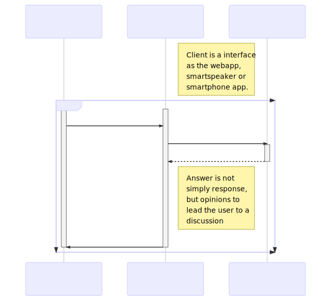

# Secussion

> Discussion about security with this system  
> セキュリティについて議論するディスカッショントレーナー

Secussion is a security discussion system for beginner trainee on a security.  
This project's goal is everyone and everywhere discuss about security on the system.  
Details of the renewal application are available at [here](http://slides.com/orleika/secussion).

# TODO

- [ ] Add test
- [ ] Increase response speed

# License

[MIT © orleika](LICENSE)
